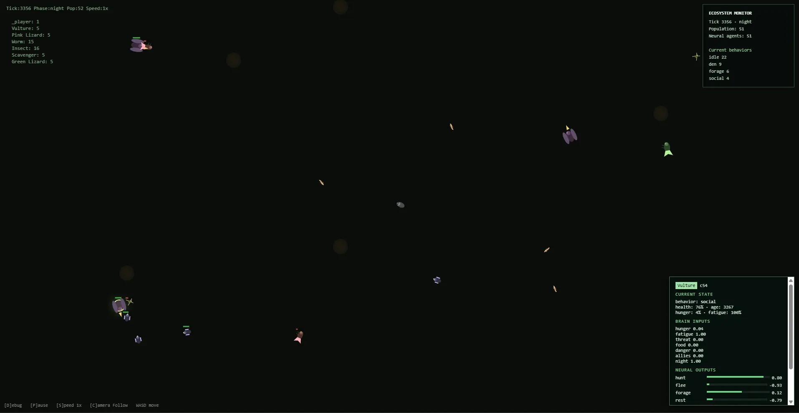

# Rain World Ecosystem



A browser-based creature ecosystem simulation inspired by Rain World. Features autonomous creatures with perception, decision-making, and survival behaviors running on a procedurally generated terrain.

## Quick Start

Open `index.html` in a browser. No build step, no dependencies.

## Controls

| Key | Action |
|-----|--------|
| WASD / Arrows | Move player |
| D | Toggle debug overlays |
| P | Pause simulation |
| S | Cycle speed (1x / 2x / 4x) |
| C | Toggle camera follow |
| Click | Inspect a creature |

## How It Works

### Terrain Generation

The world is a 3000×2000 grid divided into 64px tiles. Value noise with 4 octaves generates the heightmap, then thresholds classify each tile as **open** (walkable), **wall** (blocked), or **water** (slow movement). 10 dens are placed on guaranteed open areas with a 3×3 clear buffer around them.

### Species

| Species | Diet | Behavior |
|---------|------|----------|
| Pink Lizard | Worms, insects | Territorial packs of up to 5 |
| Green Lizard | Worms, insects, pink lizards | Solitary, aggressive |
| Vulture | Everything | Aerial apex predator |
| Worm | — | Prey, wanders aimlessly |
| Insect | — | Prey, skittish |
| Scavenger | Worms, insects | Cautious packs of up to 4 |

### Perception

Each creature has a **vision cone** (angle + range) and a **hearing radius**. For every nearby entity:

1. Check if the target is within vision range and angle
2. Verify line-of-sight (ray-marched through the tile grid)
3. Calculate visual confidence (degrades with distance)
4. Calculate hearing confidence (based on target's noise level, reduced by walls)
5. The higher of the two scores determines if the creature "notices" the target

Detected entities are classified by the observer's relationship table (`eats`, `afraid`, `rivals`, `ignores`) and sorted into prey, threats, rivals, or neutrals.

### Neural Network

A lightweight single-layer perceptron drives action preferences. Each creature has its own randomized weights.

**7 inputs:**
`hunger`, `fatigue`, `threat_present`, `food_present`, `danger_present`, `allies_nearby`, `is_night`

**8 outputs** (one per action):
`hunt`, `flee`, `forage`, `rest`, `den`, `territory`, `social`, `curiosity`

Each output is `tanh(weights[0] + Σ(weights[i+1] * input[i]))`. The neural outputs are added on top of the utility AI scores as a modifier, creating emergent behavioral variation between individuals.

### Utility AI

Before behavior execution, each action gets a **utility score** based on the creature's current state:

- **Hunt**: High when hungry, prey is close, and threat level is low. Boosted by aggression and pack mates.
- **Flee**: Scaled by threat confidence and proximity. Reduced by boldness personality trait.
- **Forage**: Active when hungry. Higher when no prey is visible (scouting).
- **Rest**: Driven by fatigue, reduced when hungry (creature pushes through).
- **Den**: Active at night for den-seeking species. Also tied to fatigue.
- **Territory**: Triggered by rival sightings in territorial species. Scaled by aggression.
- **Social**: Pack species seek allies when separated from the group.
- **Curiosity**: Investigate neutral creatures nearby. Scaled by curiosity personality.

The neural network and utility scores are summed, and the highest action wins.

### Personalities

Each creature is spawned with randomized traits from its species ranges:

- **Aggression**: Affects hunt likelihood, attack damage, territorial behavior
- **Boldness**: Reduces flee tendency, affects risk-taking
- **Curiosity**: Drives investigation of unknown creatures

### Movement & Steering

- **Seek**: Direct steering toward a target at species speed × terrain multiplier
- **Flee**: Direct steering away from a threat at 1.3× speed
- **Wander**: Random heading adjustments at reduced speed

Movement respects tile collisions. Blocked axes cause velocity reflection and heading perturbation.

### Day/Night Cycle

A 60-second full cycle with four phases: dawn → day → dusk → night. Lighting dims during night. Night is dangerous for den-seeking species (their den utility spikes), creating migration patterns at dusk and dawn.

### Level-of-Detail (Abstraction)

Creatures beyond 1200px from the player enter an **abstracted** state:

- No perception or behavior evaluation
- Stochastic movement at reduced speed
- Simplified hunger/fatigue drift
- Rare abstract encounters (random kill chance)

When the player approaches, creatures smoothly transition back to full simulation. This keeps the world feeling alive without running expensive AI on distant entities.

### Spatial Indexing

A **quadtree** partitions all creatures by position. Perception and social queries use the quadtree for O(log n) neighbor lookups instead of brute-force iteration.

### Population Control

Each species has a target population. When below target, random spawn chance triggers. When above `MAX_POP` (70), excess creatures are randomly culled (excluding the player).

### Creature Inspector

Click any creature to see its full state: current behavior, health, hunger, fatigue, age, and live neural network output bars. Brain inputs and action scores update in real time.

## Architecture

Single HTML file, zero dependencies. All logic runs in `requestAnimationFrame` with a fixed-timestep simulation loop at 20 ticks/second.

```
index.html    — everything: config, terrain, AI, rendering
demo.webp     — preview screenshot
```
